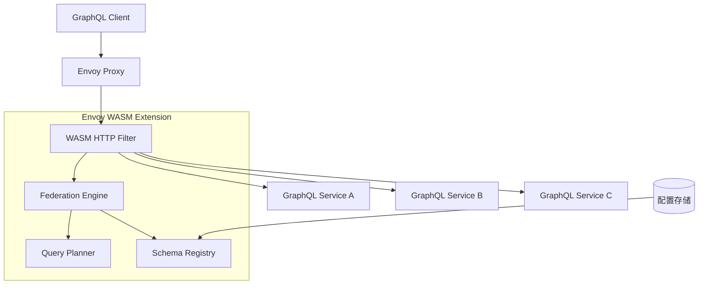
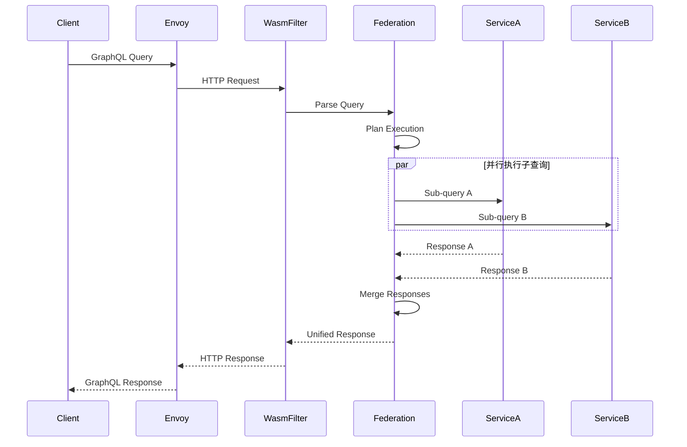
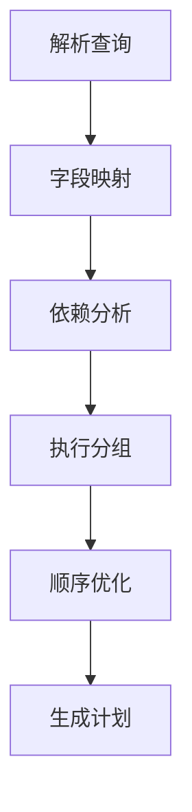
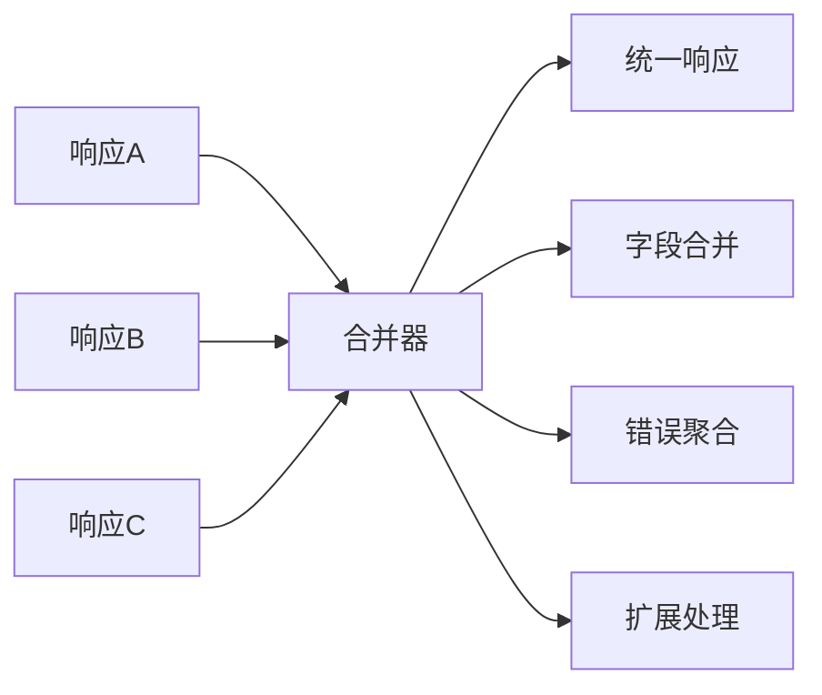

# Envoy WASM GraphQL Federation 扩展设计文档

## 概述

本项目旨在开发一个基于 Envoy WASM 的 GraphQL Federation 扩展，使用 wundergraph/graphql-go-tools 库来实现 GraphQL Federation 功能。该扩展将作为 Envoy 代理的 HTTP 过滤器，能够智能地路由和聚合来自多个 GraphQL 服务的查询。

### 核心价值
- 在网关层实现 GraphQL Federation，减少客户端复杂性
- 提供高性能的查询路由和响应聚合
- 支持动态服务发现和负载均衡
- 统一的身份验证和授权管理

### 技术栈
- **运行时**: Envoy Proxy + WASM
- **开发语言**: Go (TinyGo)
- **GraphQL 库**: wundergraph/graphql-go-tools
- **构建工具**: TinyGo + WASM

## 架构设计

### 系统架构图



### 核心组件

#### 1. WASM HTTP Filter
- **功能**: Envoy HTTP 过滤器入口点
- **职责**: 
  - 拦截 GraphQL 请求
  - 解析 HTTP 请求体
  - 调用 Federation Engine
  - 构造 HTTP 响应

#### 2. Federation Engine
- **功能**: GraphQL Federation 核心引擎
- **职责**:
  - 解析联合查询
  - 执行查询计划
  - 聚合多服务响应
  - 错误处理和合并

#### 3. Query Planner
- **功能**: 查询规划器
- **职责**:
  - 分析 GraphQL 查询
  - 生成执行计划
  - 优化子查询
  - 处理依赖关系

#### 4. Schema Registry
- **功能**: 模式注册中心
- **职责**:
  - 管理联合模式
  - 缓存子图模式
  - 模式验证
  - 模式合并

## 数据流设计

### 请求处理流程



### 数据结构设计

#### GraphQL Query Context
```go
type QueryContext struct {
    Query      string
    Variables  map[string]interface{}
    Operation  string
    RequestID  string
    UserID     string
}
```

#### Execution Plan
```go
type ExecutionPlan struct {
    SubQueries    []SubQuery
    Dependencies  map[string][]string
    MergeStrategy MergeStrategy
}

type SubQuery struct {
    ServiceName string
    Query       string
    Variables   map[string]interface{}
    Path        []string
}
```

#### Service Configuration
```go
type ServiceConfig struct {
    Name     string
    Endpoint string
    Schema   string
    Weight   int
    Timeout  time.Duration
}
```

## 核心功能模块

### 1. 查询解析模块

**功能描述**: 解析和验证传入的 GraphQL 查询

**核心流程**:
1. 解析 GraphQL 查询语法
2. 验证查询合法性
3. 提取查询字段信息
4. 识别跨服务依赖

**使用 wundergraph/graphql-go-tools**:
```go
import (
    "github.com/wundergraph/graphql-go-tools/pkg/ast"
    "github.com/wundergraph/graphql-go-tools/pkg/astparser"
    "github.com/wundergraph/graphql-go-tools/pkg/astvalidation"
)

func parseQuery(query string) (*ast.Document, error) {
    doc, report := astparser.ParseGraphqlDocumentString(query)
    if report.HasErrors() {
        return nil, report
    }
    
    validator := astvalidation.DefaultOperationValidator()
    validator.Validate(&doc, &schema, &report)
    
    return &doc, nil
}
```

### 2. 查询规划模块

**功能描述**: 基于联合模式生成最优执行计划

**核心算法**:
1. 字段分析和服务映射
2. 依赖关系构建
3. 执行顺序优化
4. 批处理优化

**规划策略**:


### 3. 服务调用模块

**功能描述**: 管理对下游 GraphQL 服务的调用

**特性**:
- 并发执行独立子查询
- 支持超时和重试
- 负载均衡
- 连接池管理

**调用接口**:
```go
type ServiceCaller interface {
    Call(ctx context.Context, service string, query SubQuery) (*Response, error)
    CallBatch(ctx context.Context, calls []ServiceCall) ([]*Response, error)
}
```

### 4. 响应合并模块

**功能描述**: 将多个子服务响应合并为统一响应

**合并策略**:
1. **字段级合并**: 按照查询结构合并字段
2. **错误处理**: 聚合和去重错误信息
3. **扩展合并**: 处理 GraphQL 扩展字段

**合并算法**:


## 配置管理

### 静态配置

**Envoy 配置示例**:
```yaml
http_filters:
- name: envoy.filters.http.wasm
  typed_config:
    "@type": type.googleapis.com/envoy.extensions.filters.http.wasm.v3.Wasm
    config:
      name: "graphql_federation"
      root_id: "graphql_federation"
      vm_config:
        vm_id: "graphql_federation"
        runtime: "envoy.wasm.runtime.v8"
        code:
          local:
            inline_string: "[WASM二进制代码]"
      configuration:
        "@type": type.googleapis.com/google.protobuf.StringValue
        value: |
          {
            "services": [
              {
                "name": "users",
                "endpoint": "http://users-service:4000/graphql",
                "schema": "...",
                "timeout": "5s"
              },
              {
                "name": "products", 
                "endpoint": "http://products-service:4000/graphql",
                "schema": "...",
                "timeout": "5s"
              }
            ],
            "federation": {
              "enable_query_planning": true,
              "enable_caching": true,
              "max_query_depth": 10
            }
          }
```

### 动态配置

**配置更新机制**:
- 支持通过 Envoy xDS API 动态更新
- 配置热更新不中断服务
- 配置版本管理和回滚

## 性能优化

### 1. 查询缓存
- **结果缓存**: 缓存完整查询结果
- **计划缓存**: 缓存执行计划
- **模式缓存**: 缓存联合模式

### 2. 批处理优化
- **查询批处理**: 合并相似子查询
- **数据加载**: 实现 DataLoader 模式
- **连接复用**: HTTP/2 连接池

### 3. 内存管理
```go
type MemoryPool struct {
    queryPools    sync.Pool
    responsePools sync.Pool
    bufferPools   sync.Pool
}

func (p *MemoryPool) GetQueryContext() *QueryContext {
    return p.queryPools.Get().(*QueryContext)
}
```

## 错误处理

### 错误分类
1. **解析错误**: GraphQL 语法错误
2. **验证错误**: 模式验证失败
3. **执行错误**: 服务调用失败
4. **合并错误**: 响应合并异常

### 错误响应格式
```json
{
  "data": null,
  "errors": [
    {
      "message": "服务调用失败",
      "locations": [{"line": 2, "column": 3}],
      "path": ["user", "profile"],
      "extensions": {
        "code": "SERVICE_UNAVAILABLE",
        "service": "users-service",
        "exception": "连接超时"
      }
    }
  ]
}
```

## 安全考虑

### 1. 查询安全
- **深度限制**: 防止过深查询攻击
- **复杂度分析**: 限制查询复杂度
- **速率限制**: 防止 DoS 攻击

### 2. 服务间通信
- **mTLS**: 服务间加密通信
- **认证传递**: JWT Token 透传
- **授权检查**: 字段级权限控制

## 监控与可观测性

### 指标收集
```go
type Metrics struct {
    QueryLatency     prometheus.Histogram
    ServiceCallCount prometheus.CounterVec
    ErrorRate        prometheus.CounterVec
    CacheHitRate     prometheus.CounterVec
}
```

### 链路追踪
- 支持 OpenTelemetry 集成
- 跨服务调用链追踪
- 查询执行性能分析

### 日志记录
```go
type LogEntry struct {
    RequestID   string
    Query       string
    Services    []string
    Latency     time.Duration
    Errors      []error
    Timestamp   time.Time
}
```

## 测试策略

### 单元测试
- 查询解析器测试
- 执行计划生成测试
- 响应合并逻辑测试
- 配置解析测试

### 集成测试
- 端到端查询测试
- 多服务集成测试
- 错误场景测试
- 性能基准测试

### 测试工具
```go
type TestHarness struct {
    MockServices map[string]*MockGraphQLService
    Federation   *FederationEngine
    TestQueries  []TestCase
}

type TestCase struct {
    Name     string
    Query    string
    Expected *Response
    Services map[string]*Response
}
```