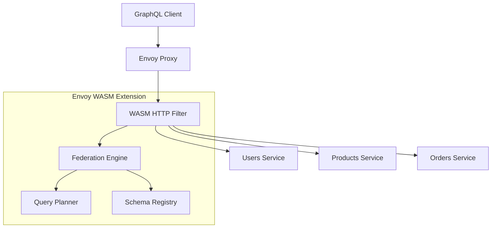

# Envoy WASM GraphQL Federation Extension

一个基于 Envoy WASM 的 GraphQL Federation 扩展，使用 wundergraph/graphql-go-tools 库实现 GraphQL Federation 功能。

## 🚀 功能特性

- **GraphQL Federation**: 在网关层实现 GraphQL Federation，支持多服务查询聚合
- **高性能**: 基于 Envoy Proxy 和 WASM 技术，提供高性能的查询处理
- **智能路由**: 自动分析查询并路由到相应的后端服务
- **响应合并**: 智能合并多个服务的响应为统一的 GraphQL 响应
- **查询优化**: 支持查询计划优化和批处理
- **动态配置**: 支持动态更新服务配置和模式
- **健康检查**: 内置服务健康检查机制
- **可观测性**: 提供详细的指标和日志记录

## 🏗️ 架构概览



## 📋 系统要求

- **Go**: 1.24 或更高版本
- **Envoy Proxy**:  Envoy >= 1.33.0
- **Docker**: 用于构建和部署（可选）

## 🛠️ 快速开始

### 1. 克隆项目

```bash
git clone <repository-url>
cd envoy-wasm-graphql-federation
```

### 2. 安装依赖

```bash
make deps
```

### 3. 构建 WASM 扩展

```bash
# 使用本地 TinyGo
make build

# 或使用 Docker（无需安装 TinyGo）
make build-docker
```

### 4. 启动开发环境

```bash
# 使用 Docker Compose 启动完整环境
docker-compose up -d

# 检查服务状态
docker-compose ps
```

### 5. 测试 GraphQL Federation

```bash
# 发送 GraphQL 查询
curl -X POST http://localhost:8080/graphql \
  -H "Content-Type: application/json" \
  -d '{
    "query": "{ users { id name } products { id name price } }"
  }'
```

## 📁 项目结构

```
├── cmd/
│   └── wasm/              # WASM 主入口
├── pkg/
│   ├── filter/            # Envoy HTTP Filter
│   ├── federation/        # Federation 引擎
│   ├── parser/            # GraphQL 解析器
│   ├── planner/           # 查询规划器
│   ├── config/            # 配置管理
│   ├── types/             # 类型定义
│   ├── errors/            # 错误处理
│   └── utils/             # 工具函数
├── examples/
│   ├── envoy.yaml         # Envoy 配置示例
│   ├── config.json        # Federation 配置示例
├── build/                 # 构建输出
├── docs/                  # 文档
├── Makefile              # 构建脚本
└── docker-compose.yml    # 开发环境
```

## ⚙️ 配置说明

### Federation 配置

```json
{
  "services": [
    {
      "name": "users",
      "endpoint": "http://users-service:4000/graphql",
      "timeout": "5s",
      "weight": 1,
      "schema": "type User { id: ID! name: String! }",
      "healthCheck": {
        "enabled": true,
        "interval": "30s",
        "timeout": "5s"
      }
    }
  ],
  "federation": {
    "enableQueryPlanning": true,
    "enableCaching": true,
    "maxQueryDepth": 10,
    "queryTimeout": "30s"
  }
}
```

### Envoy 配置

参考 `examples/envoy.yaml` 中的完整配置示例。

## 🔧 开发工具

### 可用的 Make 命令

```bash
make build          # 构建 WASM 文件
make build-docker   # 使用 Docker 构建
make test           # 运行测试
make lint           # 代码检查
make format         # 代码格式化
make clean          # 清理构建产物
make dev-setup      # 设置开发环境
make help           # 显示所有命令
```

### 开发调试

```bash
# 监听文件变化并自动重建
make watch

# 查看构建产物大小
make size

# 验证 WASM 文件
make validate-wasm
```

## 🧪 测试

### 运行单元测试

```bash
make test
```

### 运行集成测试

```bash
# 启动测试环境
docker-compose up -d

# 运行测试脚本
./scripts/integration-tests.sh
```

### 性能测试

```bash
# 使用 wrk 进行压力测试
wrk -t12 -c400 -d30s --script=scripts/graphql-load-test.lua http://localhost:8080/graphql
```

## 📊 监控和可观测性

### Envoy Admin Interface

访问 http://localhost:9901 查看 Envoy 管理界面，包括：

- 配置状态
- 运行时统计
- 日志级别控制

### 指标收集

扩展提供以下关键指标：

- `federation_query_total`: 查询总数
- `federation_query_duration`: 查询延迟
- `federation_error_total`: 错误总数
- `federation_service_calls`: 服务调用次数

### 日志记录

扩展使用结构化日志记录，支持以下日志级别：

- `DEBUG`: 详细调试信息
- `INFO`: 一般信息
- `WARN`: 警告信息
- `ERROR`: 错误信息

## 🔒 安全考虑

- **查询深度限制**: 防止过深查询攻击
- **查询复杂度分析**: 限制查询复杂度
- **速率限制**: 防止 DoS 攻击
- **服务间认证**: 支持 mTLS 和 JWT
- **输入验证**: 严格的查询和配置验证

## 🚀 部署

### 生产部署

1. 构建 WASM 文件：
   ```bash
   make build
   ```

2. 部署到 Envoy：
   ```bash
   # 将 build/envoy-wasm-graphql-federation.wasm 部署到 Envoy
   # 更新 Envoy 配置以加载 WASM 扩展
   ```

3. 配置监控和日志收集

### Kubernetes 部署

参考 `examples/k8s/` 目录中的 Kubernetes 部署示例。

## 🤝 贡献指南

1. Fork 项目
2. 创建功能分支 (`git checkout -b feature/AmazingFeature`)
3. 提交变更 (`git commit -m 'Add some AmazingFeature'`)
4. 推送到分支 (`git push origin feature/AmazingFeature`)
5. 创建 Pull Request

### 代码规范

- 遵循 Go 官方编码规范
- 运行 `make lint` 检查代码质量
- 运行 `make format` 格式化代码
- 添加适当的单元测试

## 📝 许可证

本项目采用 MIT 许可证 - 详见 [LICENSE](LICENSE) 文件。

## 🙏 致谢

- [wundergraph/graphql-go-tools](https://github.com/wundergraph/graphql-go-tools) - GraphQL 工具库
- [proxy-wasm-go-sdk](https://github.com/tetratelabs/proxy-wasm-go-sdk) - Proxy WASM Go SDK
- [Envoy Proxy](https://www.envoyproxy.io/) - 高性能代理服务器

## 📞 支持

如有问题或建议，请：

1. 查阅 [文档](docs/)
2. 搜索 [Issues](issues)
3. 创建新的 Issue

---

**注意**: 这是一个实验性项目，建议在生产环境使用前进行充分测试。